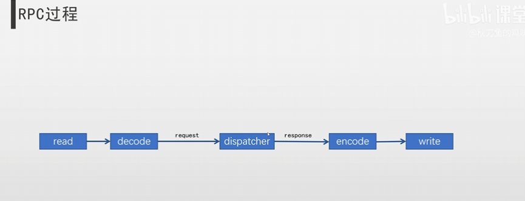

# rocket

这个项目是 bilibili 上的一个rpc项目，具体链接：https://www.bilibili.com/video/BV1cg4y1j7Wr/?spm_id_from=333.337.search-card.all.click&vd_source=69a8e7a7afa009d6fa9ddea37424446d。


### 1. 日志模块开发

日志模块：

'''
1.日志级别 （有几种输出的类型：比如 DEBUG、ERROR、INFO） 
2.打印到文件，支持日期命名，以及日志滚动
3.c 格式化风格
4.线程安全 （多线程所以需要考虑线程安全）
'''
大概有以下几个类：

LogLevel:  //日志级别
'''
Debug
Info
Error
'''

LogEvent: //日志事件，用于打印日志到文件
'''
//日志中需要打印的东西
文件名、行号
MsgNo //消息编号
进程号
线程号
日期、以及时间，精确到ms
自定义消息
'''


日志格式
'''
 //日志级别 时间                     进程号/线程号     文件名/行号    自定义消息
[Level][%y-%m-%d %H:%M:%S.%ms]\t[pid:thread_id]\t[fine_name:line][%msg]
'''

Logger 日志器
'''
1.提供打印日志的方法
2.设置日志输出的路径
'''

文件目录
bin : 放可执行文件
conf ： 放配置文件
lib ： 放最终生成的库文件
obj ： 编译过程中的产生物
rocket:     common 公共的类目录
            net: 网络库

### 2. Eventloop模块开发
在rocket里面，使用的是主从reactor模型，
服务区有一个manReactor和多个subReactor.
mainReactor由主线程运行，他作用如下：通过epoll监听listenfd的可读事件，当可读事件发生后，调用accept函数获取clientfd,然后随机取出一个subReactor,将clientfd的读写事件注册到这个subReactor的epoll上即可，也就是说，mainReactor只负责建立连接事件，不进行业务处理，也不关心已连接套接字的IO事件。

subReactor通常有多个，每个subReactor由一个线程来运行，subReactor的epoll中注册了clientfd的读写事件，当发生IO事件后，需要进行业务处理。


### 3. TimerEvent 定时任务

```
1.指定时间点 arrive_time (是一个时间搓)
2.interval, ms (间隔，在多少秒后执行这个任务)
3.is_repeated (是否重复)
4.is_cancled (是否取消)
5.task (定时的任务)

cancle()
cancleRepeated() 取消重复

```

#### 3.1.1 Timer
定时器，他是一个TimerEvent的集合
Timer继承 FdEvent

addTimerEvent();
deleteTimerEvent();
onTimer(); //当发生了IO事件之后，需要执行的方法

reserArriveTime();

multimap 存储 TimerEvent <key(arrivetime),TimerEvent>
```
```
#### 3.2 IO 线程
创建一个IO线程，他会帮我们执行：
1.创建一个新线程（pthread_create）
2.在新线程里面创建一个EventLoop,完成初始化
3.开启loop

```
class {
    pthread_t m_thread;
    pid_t m_thrad_id;
    EventLoop event_loop;
}
```

###4.TCP
TcpConnection: Read:读取客户端发来的数据，组装为RPC请求　　Excute:将RPC请求作为入参，执行业务逻辑得到RPC响应  Write:将RPC响应发送给客户端。

TcpBuffer:
InBuffer: 1.服务端调用read成功从socket缓冲区读取数据，会写入到InBuffer
           2. 服务端从InBuffer前面读取数据，进行解码得到请求

OutBuffer:1.服务端向外发送数据，会将数据编码后写入到OutBuffer后面 2.服务端在fd可写的情况下，调用write将OutBuffer里面的数据全部发送出去  

TcpClient：有以下步骤： 1. Connect:连接对端机器 2.Write：将RPC响应发送给客户端  3.读取客户端发来的数据，组装为RPC请求
非阻塞Connect: 返回0，表示连接成功  返回-1，但errno == EINPROGRESS，表示连接正在建立，此时可以添加到epoll中去监听其可写事件。等待可写事件就绪后，调用getsocketopt获取fd上的错误，其他errno直接报错。


###5.编解码器
为什么要自定义协议格式
既然用了prootobuf做序列化，为什么不直接用序列化后的结果直接发送，而要在上面自定义一些字段？
（1）为了方便分割请求，因为protobuf后的结果是一串无意义的字节流，你无法区分哪里是开始或是结束。比如说两个Message对象序列化后的结果排在一起，你甚至无法分开这两个请求。在tcp传输是按照字节流传输，没有包的概念，因此应用层就更无法区分了。
（2）为了定位：加上MsgID等信息，能帮助我们匹配一次RPC的请求和响应，不会串包
（3）错误提升：加上错误信息，能很容易知道RPC失败的原因，方便问题定位。


## rpc服务端流程

流程：
启动时就注册OrderService对象
1.从buffer中读取数据，然后decode得到请求的TinyPBProtocol，然后从TinyPBProtocol中得到method_name，从OrderService对象里根据service.method_name找到func
2.找到对应的request type 以及 response type
3.将请求体TinyPBProtocol里面的pb_data反序列化为request type的一个对象，声明一个空的response type对象。
4.func(request,response)
5.将response对象序列化为pb_data，在塞入到TinyPBProtocol结构体中，然后encode塞入到buffer里面，就会发送回包

## RpcChannel 用于客户端跟服务端通信

